# Сравнительный анализ современных моделей голосовых эмбеддингов

Автор: Максим Гончаровский

Дата: 04.11.2025

GitHub: https://github.com/Maksim-Goncharovskiy 
_________________
### Содержание
1. [Введение](#title1)
2. [Теоретическая часть](#title2)
	- 2.1. [Введение в голосовые эмбеддинги](#title2.1)
	- 2.2. [TDNN - основа x-векторов](#title2.2)
	- 2.3. [Статистический пуллинг](#title2.3)
	- 2.4. [PyAnnote: TDNN + SincNet](#title2.4)
	- 2.5. [EcapaTDNN](#title2.5)
	- 2.6. [SpeakerNet](#title2.6)
	- 2.7. [TitaNet](#title2.7)
3. [Практическая часть](#title3)
	- 3.1. [Датасет](#title3.1)
	- 3.2. [Метрики](#title3.2)
	- 3.3. [Библиотеки и модели](#title3.3)
	- 3.4. [Результаты](#title3.4)
4. [Источники](#title4)

__________________________________
# <a id="title1">Введение</a>
Извлечение векторных представлений голосовых характеристик (голосовых эмбеддингов) - это базовый и очень важный этап в решении многих задач обработки аудио таких как, например: классификация, верификация и диаризация дикторов. 

**Цель** данного небольшого исследования - изучение архитектурных особенностей современных моделей для извлечения голосовых эмбедингов и проведение сравнительного тестирования разных моделей для выбора наиболее подходящей для внедрения в пайплайн потоковой диаризации.

Модели будут сравниваться по их способности отделять эмбеддинги разных дикторов друг от друга. 

___________________________________
# <a id="title2">Теоретическая часть </a>
## <a id="title2.1">Введение в голосовые эмбеддинги </a>
Извлечение голосовых эмбеддингов - это преобразование последовательности проивзольной длины (аудио) к одному вектору фиксированной длины (эмбеддинг). 

Довольно продолжительное время самым популярным методом векторизации голосовых характеристик были i-векторы [1], однако к настоящему моменту они полностью были вытеснены x-векторами - эмбеддингами, получаемыми при помощи нейросетевых моделей. 

Одна из главных характеристик аудиоданных - это их продолжительность во времени. По этой причине первыми моделями, которые стали популярны на поприще обработки аудио - были рекуррентные нейронные сети RNN, которые позволяют обрабатывать последовательности произвольной длины, агрегируя информацию о последовательности в своих скрытых состояниях.

Однако как и в области NLP, в аудио-обработке у RNN возникли проблемы: 
- забывание информации
- неэффективность (невозможность параллелизации)
- плохая чувствительность к локальным паттернам (важно для изучения характеристик голоса)

Эти проблемы простимулировали развитие иных решений.
## <a id="title2.2">TDNN - основа x-векторов </a>

TDNN (**T**ime **D**elay **N**eural **N**etwork) - это архитектура для обработки вытянутых по времени данных, в частности, аудио. 

Оригинальная TDNN - это нейронная сеть, основанная лишь на полносвязных слоях, без рекуррентности. Её идея - в последовательной обработке аудио с увеличением временного масштаба в каждом новом слое:
1. На вход поступает последовательность векторов MFCC.
2. Последовательность обрабатывается окнами некоторой длины N, то есть заданное окно содержит N-векторов, которые вытягиваются в один вектор и прогоняются через полносвязный слой, который агрегирует информацию из N векторов в один вектор, который поступает на вход в следующий слой.
3. Окна берутся с некоторым смещением. 
4. Выходом слоя является новая последовательность векторов, каждый из которых агрегирует в себе информацию из исходного фрагмента аудио.

> ❗ __Важно__
>- Важным уточнением является то, что в одном слое все фрагменты аудио обрабатываются одними и теми же весами. 
>- Данная операция напоминает свёртку и на самом деле в современных TDNN-архитектурах основной операцией является 1d-свёртка вдоль оси времени.

Несмотря на то, что TDNN-модели продемонстрировали значительное превосходство над ранее применявшимися RNN, исследователи [2] выявили потенциал для дальнейшей оптимизации. Было установлено, что выходные векторы, формируемые для смежных временных окон, обладают высокой степенью корреляции. Для решения этой проблемы авторами [2] был предложен метод разреженного сэмплирования, при котором информация агрегируется не из всех, а лишь из части выходных векторов скрытого слоя. Примечательно, что степень этого сэмплирования увеличивается по мере перехода к более высоким слоям архитектуры, одновременно с расширением временного контекста анализируемого окна. Данный подход позволяет модели эффективно захватывать долговременные зависимости в речевом сигнале, обеспечивая обработку информации на более широком временном масштабе при снижении вычислительных затрат.


<center>Рисунок 1. Схематическая структура TDNN-сети. Красным цветом выделена часть, которую оставили авторы [2] для повышения эффективности TDNN. </center>

## <a id="title2.3">Статистический пуллинг</a>
Выходом TDNN-сети является обновлённая последовательность векторов, каждый из которых содержит информацию об определённом фрагменте аудио. Однако наша задача - получение только одного вектора фиксированной размерности.

В задаче извлечение голосовых эмбеддингов популярным методом для преобразования последовательности к одному вектору стал __статистический пуллинг__. Его идея проста:
1. Дана последовательность векторов для фрагментов аудио: $$h_{1}, h_{2}, h_{3}, ..., h_{T}$$
2. Рассчитываются статистические показатели этой последовательности:
	- вектор средних значений: $$μ = \frac{1}{T}\sum_{t=1}^{T} h_t$$
	- вектор средних стандартных отклонений: $$σ = \sqrt{\frac{1}{T}(\sum_{t=1}^{T} h_{t}^2)  - μ^2}$$
3. Полученные векторы μ и σ конкатенируются в один вектор, из которого в дальнейшем будет получен эмбеддинг. 


## <a id="title2.4">PyAnnote: SincNet + TDNN </a>
PyAnnote - одна из самых популярных open source библиотек для диаризации дикторов, предоставляющая помимо этого и другие инструменты обработки речи. Данная библиотека использует собственную модель для извлечение эмбеддингов, которая является синтезом двух архитектур: TDNN и SincNet.

Архитектура SincNet была представлена в статье [3], в которой авторы затронули важную проблему свёрточных сетей и первичного извлечения признаков в обработке звука - неэффективность обучения первых слоёв свёрточной сети.

Во-первых, модели приходится с нуля подбирать фильтры, извлекающие полезные представления аудио. Во-вторых, в глубоких сетях возникает проблема затухающих градиентов, из-за чего эти самые фильтры в первых слоях может быть сложнее обучать. 

Кроме того, критике подвергается практика использования заранее извлечённых признаков (например, MFCC, Mel-спектрограмм), поскольку жёсткая предварительная обработка накладывает априорные ограничения на набор анализируемых частот, делая работу модели менее гибкой. По этой причине SincNet принимает на вход аудио в волновом виде.

В качестве альтернативы авторами [3] был предложен подход, основанный на использовании параметризованных полосовых фильтров, аппроксимированных функцией sinc, в качестве ядер первого свёрточного слоя. В отличие от стандартных свёрток, где оптимизируется каждый параметр ядра, в SincNet обучаемыми параметрами являются лишь нижняя (f1) и верхняя (f2) частоты среза каждого фильтра. Это позволяет эффективно ограничить пространство поиска, задав фильтрам осмысленную с точки зрения обработки сигнала структуру - усиление частот в полосе [f1, f2] и подавление частот за её пределами.

Данная модификация приводит к нескольким преимуществам: ускорению сходимости обучения за счёт сокращения числа обучаемых параметров в первом слое, улучшению устойчивости обучения первых слоёв и повышению интерпретируемости модели, поскольку анализ обученных значений f1 и f2 позволяет выявить частотные диапазоны, наиболее релевантные для решаемой задачи.

Для лучшего понимания может быть полезным посмотреть как SincNet реализована в PyAnnote:
```python
import torch
import torch.nn as nn
import torch.nn.functional as F
from asteroid_filterbanks import Encoder, ParamSincFB


class SincNet(nn.Module):
    def __init__(self, sample_rate: int = 16000, stride: int = 1):
        super().__init__()

        self.stride = stride

        self.wav_norm1d = nn.InstanceNorm1d(1, affine=True)

        self.conv1d = nn.ModuleList()
        self.pool1d = nn.ModuleList()
        self.norm1d = nn.ModuleList()

        self.conv1d.append(
            Encoder(
                ParamSincFB(
                    80,
                    251,
                    stride=self.stride,
                    sample_rate=sample_rate,
                    min_low_hz=50,
                    min_band_hz=50,
                )
            )
        )
        self.pool1d.append(nn.MaxPool1d(3, stride=3, padding=0, dilation=1))
        self.norm1d.append(nn.InstanceNorm1d(80, affine=True))

        self.conv1d.append(nn.Conv1d(80, 60, 5, stride=1))
        self.pool1d.append(nn.MaxPool1d(3, stride=3, padding=0, dilation=1))
        self.norm1d.append(nn.InstanceNorm1d(60, affine=True))

        self.conv1d.append(nn.Conv1d(60, 60, 5, stride=1))
        self.pool1d.append(nn.MaxPool1d(3, stride=3, padding=0, dilation=1))
        self.norm1d.append(nn.InstanceNorm1d(60, affine=True))

```

Код создания полосовых фильтров:
```python
# создает 80 полосовых фильтров длины 251
# по умолчанию f_min = f_max = 50 Гц
ParamSincFB(
	80,
    251,
    stride=self.stride,
    sample_rate=sample_rate,
    min_low_hz=50,
    min_band_hz=50,
)
```

## <a id="title2.5">ECAPA-TDNN </a>
Успех архитектуры TDNN в задаче извлечения голосовых эмбеддингов побудил исследователей к экспериментам по улучшению этой архитектуры. Большинство новых механизмов были заимствованы из других областей глубокого обучения.

Например, были внедрены skip-connections по аналогии с ResNet для проброса информации между слоями и борьбы с затухающими градиентами. 
Также в процесс статистического пуллинга была внедрена операция self-attention похожая на ту, что применяется в трансформерах, которая выполнялась по временной оси, то есть считалась между репрезентациями разных временных промежутков . Примечательно, что эта операция может интерпретироваться как решение задачи VAD (voice activity detection), то есть модель учится определять, какие векторы относятся к голосу, а какие нет. 

На этом улучшения не закончились - вышла статья [4], презентующая архитектуру ECAPA-TDNN с тремя большими изменениями классической TDNN:
1. Attentive Stat Pooling - модификация механизма внимания в статистическом пуллинге.
2. Squeeze-Excitation-блоки - моделирование взаимосвязей каналов и добавление глобального контекста.
3. Multi Layer Feature Aggregation - аггрегирование информации с разных слоёв перед входом в слой пуллинга.

| 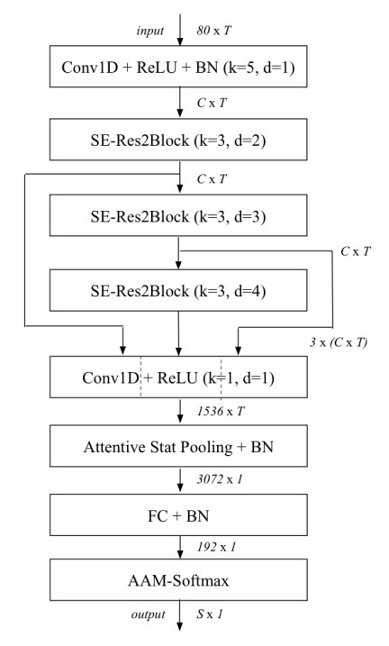                                                | 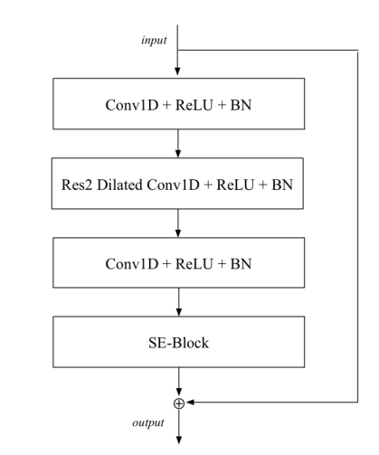                                                 |
| ---------------------------------------------------------------- | ---------------------------------------------------------------- |
| <center>Рисунок 2.1. Полная архитектура ECAPA-TDNN [4].</center> | <center>Рисунок 2.2. Устройство SE-Res2Block блока [4].</center> |


### Attentive Stat Pooling
Авторами ECAPA-TDNN была выдвинута гипотеза о том, что полезным может быть рассчитывать вес не целиком для каждого временного фрагмента, а отдельно для каждого канала в каждый момент времени. Интуиция у этого следующая: в каждый момент времени разные каналы могут быть по разному важны. 

Для этого авторы разработали новый attention-based механизм, выполняемый следующим образом:
1) Вычисляются ненормированные коэффициенты значимости канала `c` в момент времени `t` - `e_{t, c}` по формуле (1):

$$e_{t, c} = v_cf(W[h_{t}, μ, σ] + b) + k_{c}\space\space\space\space(1)$$
> 💡 __Пояснение__
> - μ - это вектор поканальных средних по всем `h_t`: $$μ = \frac{1}{T}\sum_{t=1}^{T} h_t$$
> - σ - это вектор поканальных стандартных отклонений: $$σ = \sqrt{\frac{1}{T}(\sum_{t=1}^{T} h_{t}^2)  - μ^2}$$
> - W - обучаемая матрица, переводящая сконкатенированный вектор [h_t, mu, sigma] из пространства 3Cx1 в пространство Rx1
> - v_c, k_c - это обучаемые под канал c параметры. v_c - вектор Rx1, k_c - скаляр. Так как количество каналов равно C имеем обучаемую матрицу V: RxC и вектор k: Rx1
> - f - функция активации

2) Значения `e_{t, c}` нормализуются функцией `softmax` независимо по каждому каналу по всем временным фрагментам `t ∈ [1, T]` по формуле (2):
   
$$\alpha_{t, c} = \frac{exp(e_{t, c})}{\sum_{\tau=1}^{T}exp(e_{\tau, c})}\space\space\space\space(2)$$

Шаги 1) и 2) визуализированы на рисунке ниже:

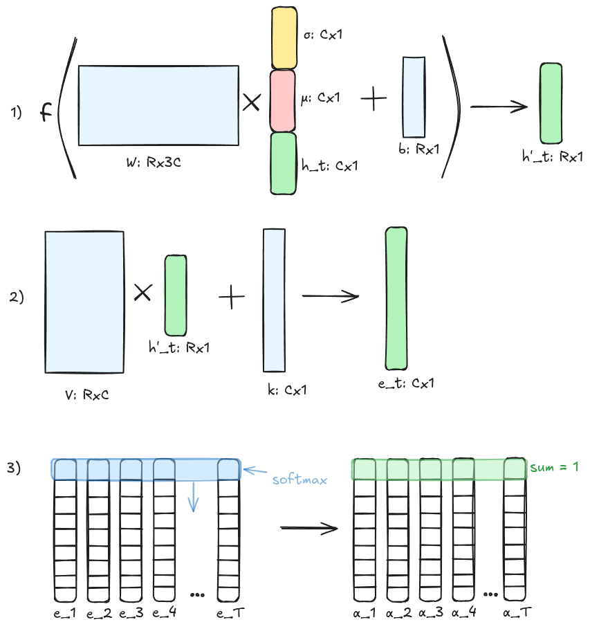
<p align="left"><center>Рисунок 3. Визуализация рассчёта весов внимания в attentive stat pooling слое.</center></p>

3) Далее рассчитываются взвешенный вектор средних и взвешенный вектор стандартных отклонений по формулам (3) и (4), которые впоследствии конкатенируются, что и является выходом слоя пуллинга.
$$μ = \sum_{t=1}^{T} \alpha_{t}h_t\space\space\space\space(3)$$
$$σ = \sqrt{(\sum_{t=1}^{T} \alpha_{t}h_{t}^2)  - μ^2}\space\space\space\space(4)$$
### SE (Squeeze-Excitation)
Ещё одной идеей, внедрённой в ECAPA-TDNN, стало добавление в векторные представление временных фрагментов $h_{t}$ глобальной информации о взаимосвязи каналов. Для этого были добавлены SE-блоки, которые работают по следующему принципу:
1) Считается средний вектор `z` : $$z = \frac{1}{T}\sum_{t=1}^{T} h_t$$
2) Средний вектор `z` преобразуется в глобальный вектор значимости каналов `s` по формуле (5):

$$s = \sigma(W_{2}f(W_{1}z+b_{1})+b_{2})\space\space\space\space(5)$$

3) В каждый вектор `h_t` добавляется глобальный контекст из вектора `s` путём __поэлементного__ умножения:

$$ h̃_{t} = s*h_{t} $$

### MFA (Multi-layer Feature Aggregation)
Для получения эмбеддинга обычно используется выход только последнего слоя, однако в ECAPA-TDNN было решено агрегировать информацию из выходов всех трёх SE-Res2Block блоков.
Интуиция этого решения в том, что для эмбеддингов может быть важна также и некоторая низкоуровневая информация, получаемая в нижних слоях. 


## <a id="title2.6">SpeakerNet </a>
Данная архитектура была представлена исследователями из NVIDIA в 2020 году и состоит она из трёх частей:
1. `Encoder` - это часть ASR-модели QuartzNet, которая применяется для извлечения информации из входной аудио-последовательности в другую последовательность такой длины, где каждому временному фрагменту соответствует некоторый содержательный вектор фиксированной длины.
2. `Статистический пулинг`
3. `Decoder` - это несколько полносвязных слоёв, которые переводят полученный статистический вектор в итоговый эмбеддинг.


<center>Рисунок 4. Архитектура SpeakerNet (взято из [5])</center>

#### Encoder
Энкодер состоит из чередующихся операций depth-wise свёртки, батч нормализации, функции активации и dropout. Эти блоки соединяются между собой через residual-connections. Эти операции повторяются N-раз.
>💡 __Пояснение__
>Depth-wise свёртка - это свёртка, выполняемая независимо по каждому каналу (на каждый канал своё ядро) вдоль оси времени. Визуализация одномерной depth-wise свёртки:
>
> 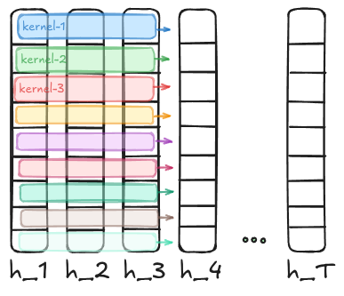
> Рисунок 5. Визуализация depth-wise свёртки.

#### Декодер
Как было сказано выше, декодер - это несколько полносвязных слоев, которые проецируют полученный сконкатенированный статистический вектор в эмбеддинг размерности 512. 

## <a id="title2.6"> TitaNet </a>
Это модель, предложенная исследователями из NVIDIA в 2021 году, из рассматриваемых моделей - это самая последняя вышедшая.
Данная архитектура в отличие от SpeakerNet использует  механизмы из ECAPA-TDNN:
- Используется такой же channel-wise attention pooling слой
- SE-блоки для взвешивания разных каналов


<center>Рисунок 6. Архитектура TitaNet (взято из [6])</center>

Кроме того, TitaNet использует чередование `depthwise` и `pointwise` свёрток: 
- `Depthwise` свёртки аггрегируют информацию между соседними временными фрагментами независимо по каждому каналу (см. выше раздел про SpeakerNet).
- `Pointwise` свёртки решают другую задачу: они выполняются независимо для каждого временного вектора, аггрегируя информацию между каналами. Pointwise свёртка позволяет менять количество каналов и моделирует взаимосвязи между каналами. 
_____________________________________
______________________________________________
# <a id="title3">Практическая часть</a>
Задача практической части - сравнение современных предобученных моделей извлечения голосовых эмбеддингов на реальных русскоязычных аудио-данных с визуализацией результатов и подсчётом разных метрик.

## <a id="title3.1">Датасет</a>
Первым делом был сформирован датасет русскоязычных дикторов из датасета VoxTube. Для каждого диктора было извлечено по 25 аудиозаписей, дикторов всего 785, итого получили 19625 аудиозаписей. Каждая аудиозапись длительностью приблизительно 4 секунды. Полученный датасет можно найти и скачать на платформе kaggle по ссылке: https://www.kaggle.com/datasets/maksimgoncharovskiy/voxtube-ru

Кроме того вы можете использовать код из ноутбука `notebooks/load-voxtube.ipynb` из репозитория исследования для формирования собственного датасета из VoxTube (например, если вы хотите загрузить другой язык или увеличить количество аудиозаписей на диктора). 

## <a id="title3.2">Метрики</a>
Как правило, модели голосовых эмбеддингов сравниваются в контексте конкретной решаемой задачи, например: классификация, верификация, диаризация и тд. И в качестве метрик в конечном счёте используются метрики конечной задачи, например, DER для диаризации, EER для верификации. 

В данной работе мы постараемся сравнить эмбеддинги без привязки к конкретной задаче, однако в конечном итоге планируется выбрать модель, которая лучшего всего подойдёт для использования в пайплайне потоковой диаризации. Соответственно выдвенем  ключевые требования к модели: 
- внутриклассовое расстояние минимально (эмбеддинги одного диктора очень похожи)
- межклассовое расстояние максимально (эмбеддинги разных дикторов легко отличимы)

Для того чтобы оценить степень удовлетворения этих условий разными моделями введём несколько метрик.
#### 1. Перекрытие внутриклассового и межклассового распределений расстояния
Ввёдем для этого показателя следующее сокращение - OIIDD (Overlap of Intra-class and Inter-class Distances Distributions).

Идея:
- считаются два распределения
- первое - это распределение расстояний от каждого эмбеддинга до своего центроида (предварительно рассчитанного для каждого диктора)
- второе - это распределение расстояний от каждого эмбеддинга до ближайшего чужого центроида
- вычисляется площадь перекрытия двух распределений
- чем меньше площадь перекрытия, тем лучше разделяются эмбеддинги
#### 2. Количество ошибок ближайшего центроида
Введём для этого показателя следующее сокращение - CCR (Centroid Confusion Rate)

Идея:
- считается количество ошибок определения ближайшего центроида (когда эмбеддинг оказывается ближе к чужому центроиду)
- чем меньше ошибок, тем компактнее эмбеддинги лежат к своим центроидам

#### 3. Метрика силуэта
Эта метрика используется для оценки качества кластеризации и она позволяет оценивать два аспекта:
- насколько близки объекты внутри своего кластера
- насколько далеко объекты находятся от соседнего кластера
Поэтому оценка этой метрики в нашей задаче также будет полезной, однако в данной работе мы будем её использовать как вспомогательную, обобщающую. 


В первую очередь перечисленные метрики будут считаться на основе косинусной близости в исходной размерности эмбеддингов как метода вычисления расстояния. Однако в качестве вспомогательных показателей данные метрики будут рассчитаны и для эмбеддингов в двумерном пространстве (полученных при помощи модели UMAP) с евклидовым расстоянием.

Кроме того будут получены визуализации эмбеддингов в двумерном пространстве для визуальной оценки качества. Также мы построим графики с визуализацией перекрытий распределений (OIIDD). 
## <a id="title3.3">Библиотеки и модели</a>
В сравнении будут участвовать следующие модели:
- `pyannote-embedding` из библиотеки `pyannote-audio`
- `EcapaTDNN` из библиотеки `speechbrain`
- `EcapaTDNN` из библиотеки `nemo-toolkit` (NVIDIA)
- `SpeakerNet` из библиотеки `nemo-toolkit` (NVIDIA)
- `TitaNet` из библиотеки `nemo-toolkit` (NVIDIA)

## <a id="title3.4">Результаты</a>
Сначала были получены эмбеддинги для всех аудиозаписей из датасета. Можно ознакомиться с кодом извлечения эмбеддингов в ноутбуках:
- `notebooks/pyannote-embeddings.ipynb`
- `notebooks/nemo-embeddings.ipynb`
- `notebooks/speechbrain-embeddings.ipynb`
Для каждой библиотеки рекомендуется создавать своё виртуальное окружение.

Далее был проведён сравнительный анализ полученных эмбеддингов (см. `notebooks/analysis.ipynb`).

#### 1. Таблица с метриками

|                       | Cosine OIIDD (↓) | Cosine CCR (↓) | Cosine Silhoette (↑) | Euclidean OIIDD (↓) | Euclidean CCR (↓) | Euclidean Silhoette (↑) |
| --------------------- | ---------------- | -------------- | -------------------- | ------------------- | ----------------- | ----------------------- |
| **SpeakerNet**        | 0.153            | 231            | 0.200                | 0.663               | 5697              | 0.330                   |
| **TitaNet** 🏆        | 0.072            | **20** 🏅      | **0.342**🏅          | **0.139**🏅         | **994** 🏅        | **0.857** 🏅            |
| **PyAnnote**          | 0.101            | 55             | 0.191                | 0.628               | 6295              | 0.275                   |
| **Ecapa-Nemo**        | 0.122            | 48             | 0.324                | 0.247               | 1749              | 0.767                   |
| **Ecapa-Speechbrain** | **0.060**🏅      | 27             | 0.300                | 0.264               | 1566              | 0.706                   |

#### 2. Визуализации
##### SpeakerNet

| Наименования графика | График |
| ----------------- | ----------------------------------------------------------------- |
| 2d-визуализация   | 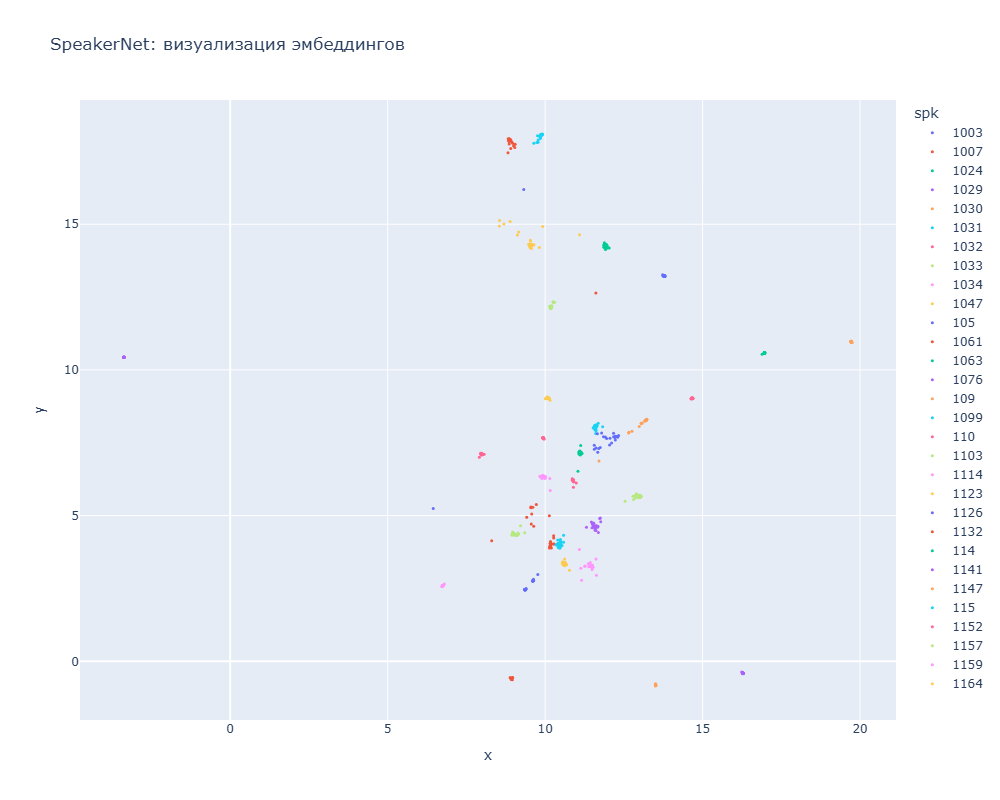        |
| OIIDD (cosine)    | 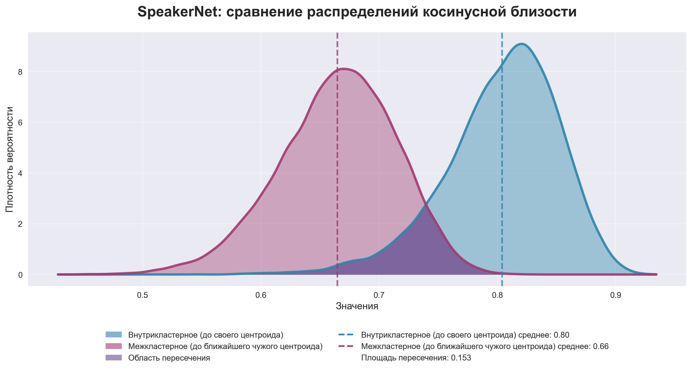    |
| OIIDD (euclidean) | 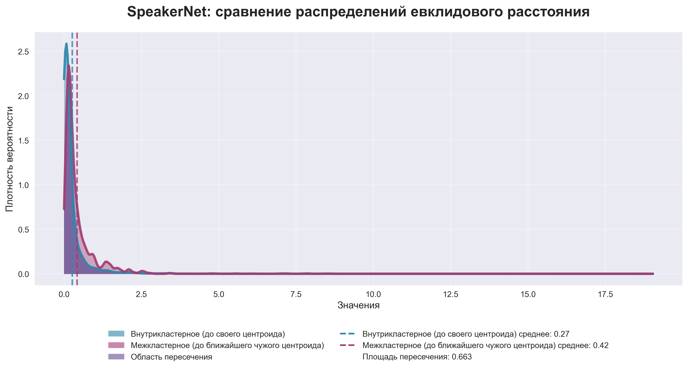 |

##### PyAnnote
| Наименования графика | График |
| ----------------- | ----------------------------------------------------------------- |
| 2d-визуализация   | 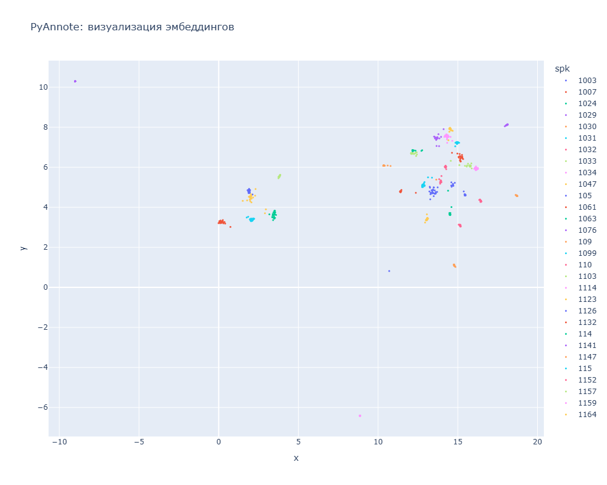         |
| OIIDD (cosine)    | 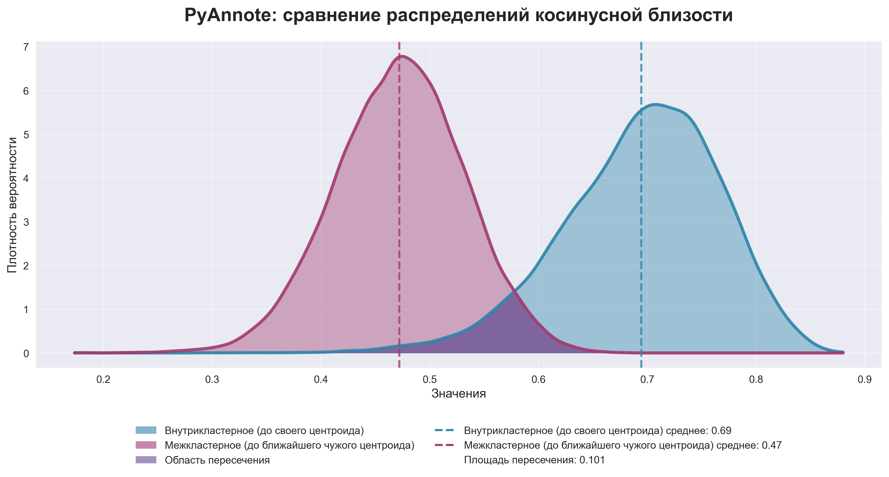    |
| OIIDD (euclidean) | 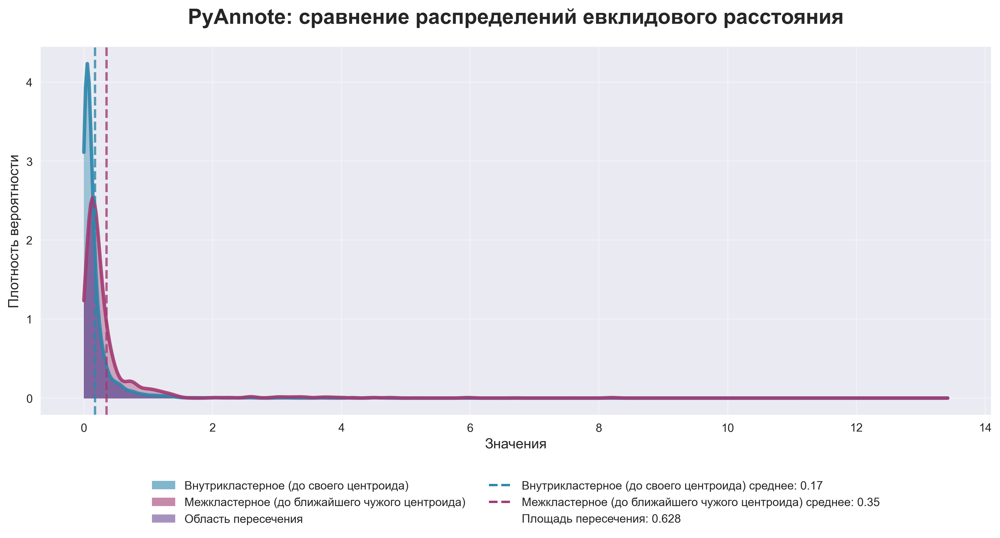 |

##### EcapaTDNN-Nemo
| Наименования графика | График |
| ----------------- | ----------------------------------------------------------------- |
| 2d-визуализация   | 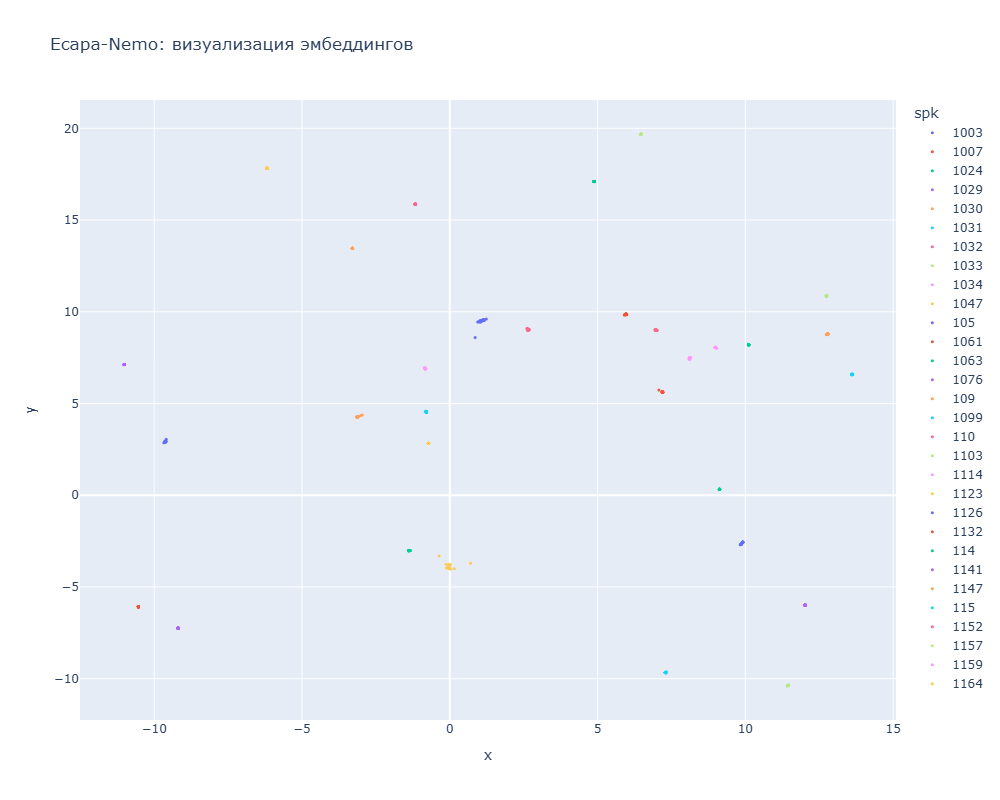         |
| OIIDD (cosine)    | 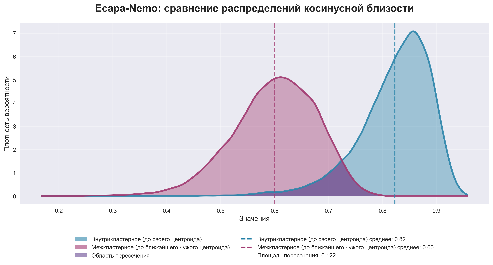   |
| OIIDD (euclidean) | 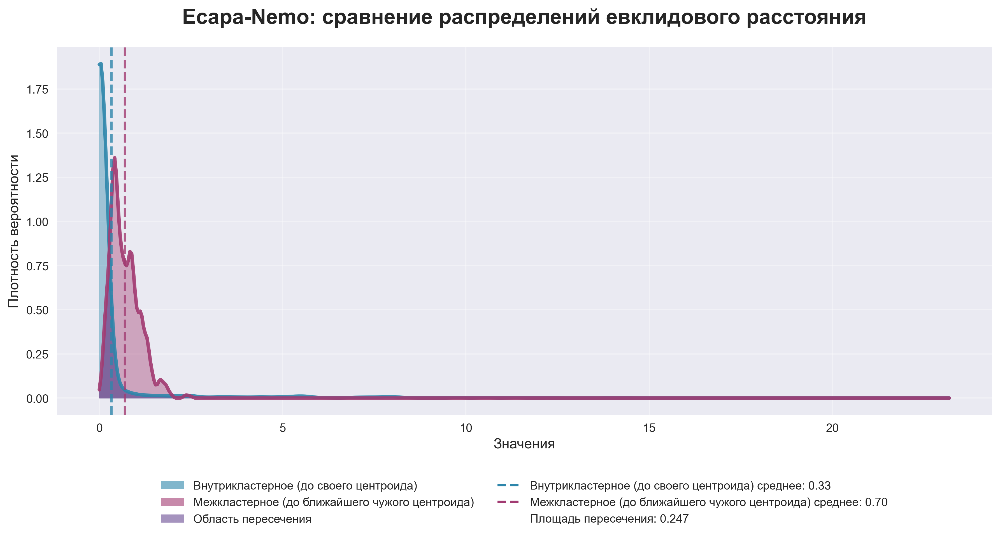|

##### EcapaTDNN-Speechbrain
| Наименования графика | График |
| ----------------- | ----------------------------------------------------------------- |
| 2d-визуализация   | 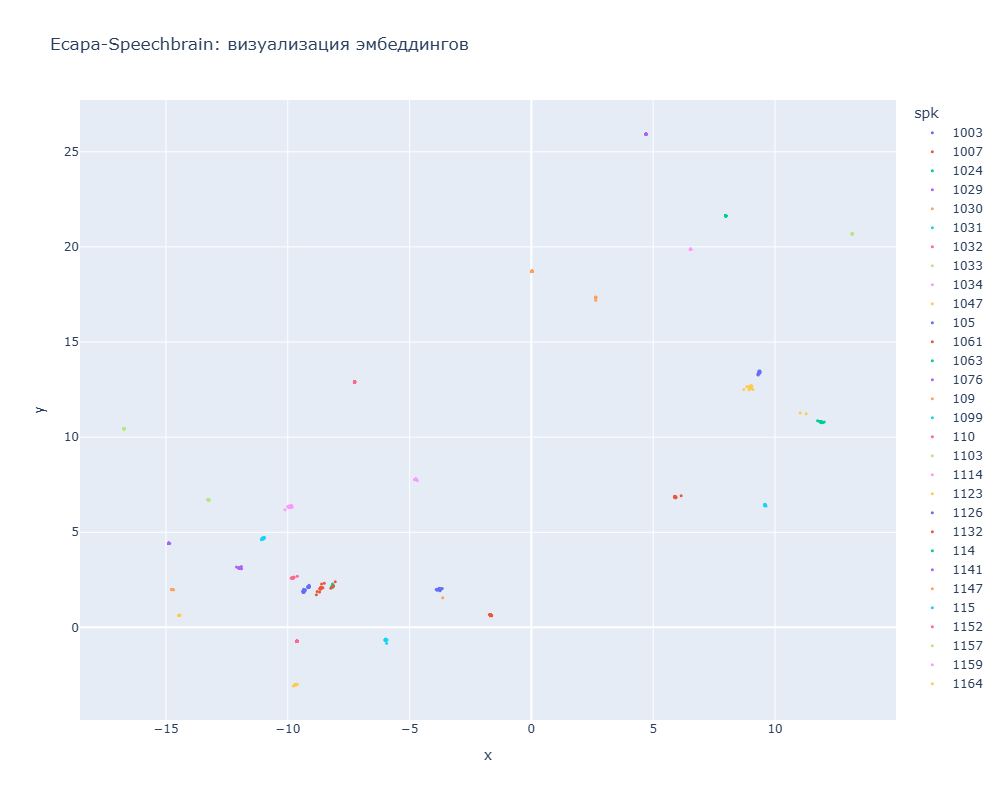|
| OIIDD (cosine)    | 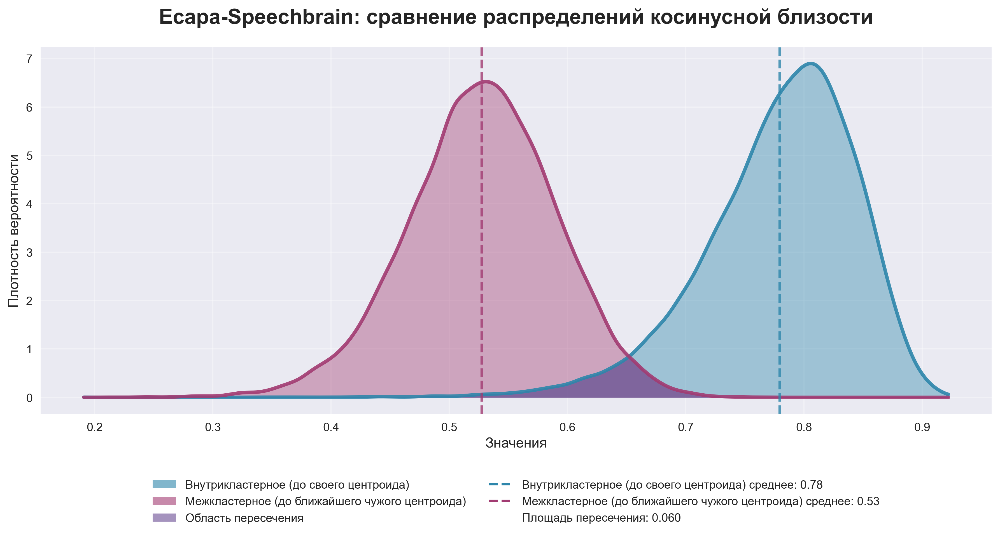|
| OIIDD (euclidean) | 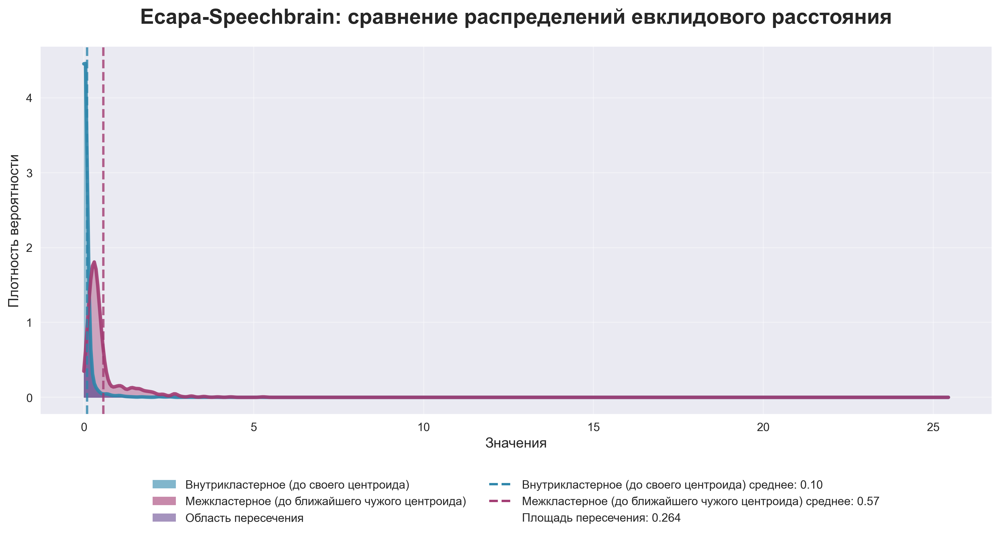 |

##### TitaNet
| Наименования графика | График |
| ----------------- | ----------------------------------------------------------------- |
| 2d-визуализация   | 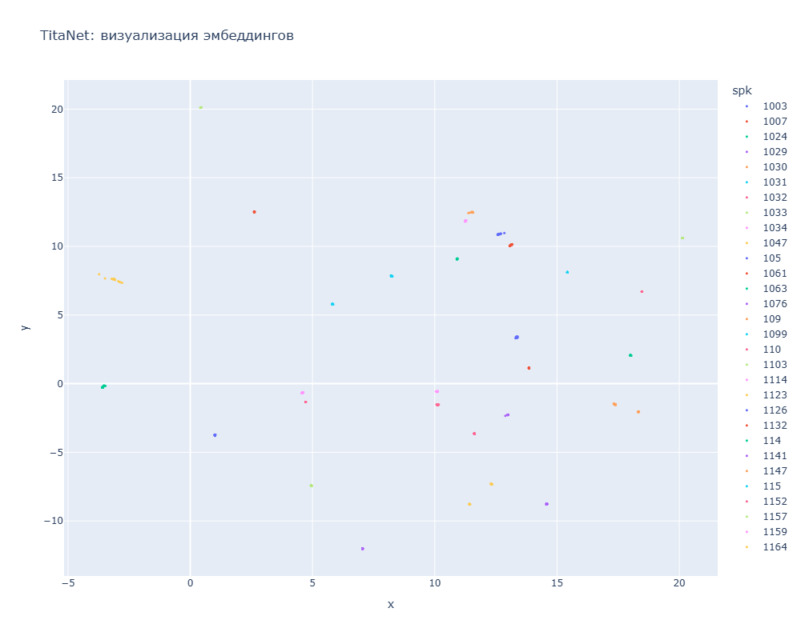|
| OIIDD (cosine)    | 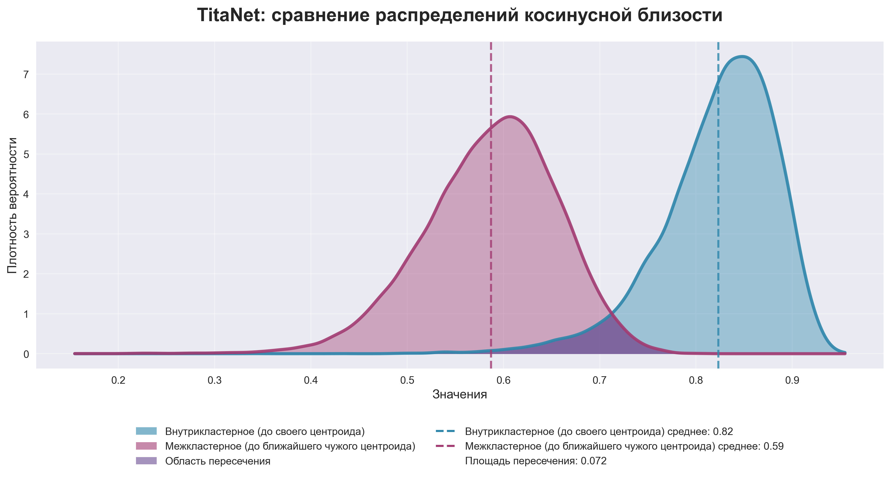|
| OIIDD (euclidean) | 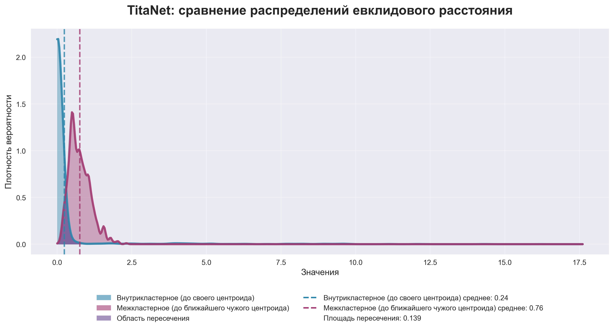|

___________________________________________
_______________________________________

# <a id="title4">Источники</a>
[1]. Диаризация на основе модели GMM-UBM и алгоритма MAP adaptation // Хабр (URL: https://habr.com/ru/articles/420515/)

[2]. A time delay neural network architecture for efficient modeling of long temporal contexts // (URL: https://www.isca-archive.org/interspeech_2015/peddinti15b_interspeech.pdf)

[3]. SPEAKER RECOGNITION FROM RAW WAVEFORM WITH SINCNET (URL: https://arxiv.org/pdf/1808.00158)

[4]. ECAPA-TDNN: Emphasized Channel Attention, Propagation and Aggregation in TDNN Based Speaker Verification (URL: https://arxiv.org/pdf/2005.07143)

[5]. SPEAKERNET: 1D DEPTH-WISE SEPARABLE CONVOLUTIONAL NETWORK FOR TEXT-INDEPENDENT SPEAKER RECOGNITION AND VERIFICATION (URL: https://arxiv.org/pdf/2010.12653)

[6]. TITANET: NEURAL MODEL FOR SPEAKER REPRESENTATION WITH 1D DEPTH-WISE SEPARABLE CONVOLUTIONS AND GLOBAL CONTEXT (URL: https://arxiv.org/pdf/2110.04410)
